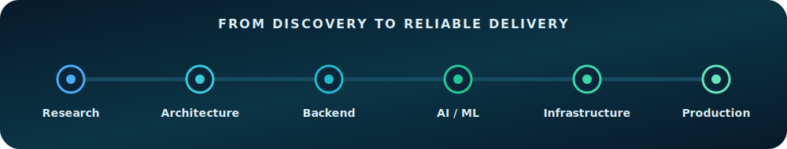
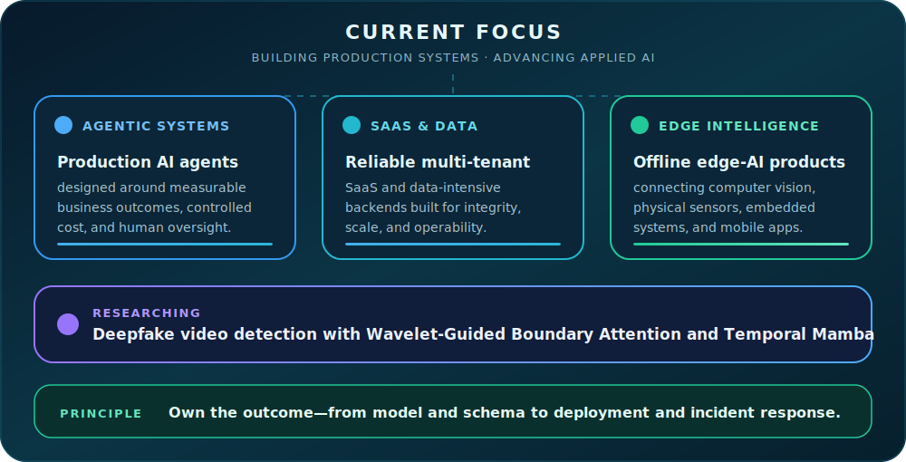
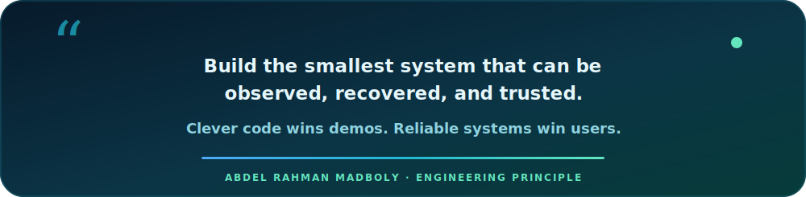

<div align="center">


[](https://git.io/typing-svg)

[](https://linkedin.com/in/abdllrhmh)
[](mailto:abdllrhmh24@gmail.com)
[](#)

</div>

## I engineer the whole system

I am an **AI & Machine Learning Engineer** and **backend/full-stack developer** who takes ambitious systems from first architecture to reliable production. I build agentic AI platforms, production APIs, data pipelines, edge-computer-vision products, and the infrastructure that keeps them running. I am currently open to roles where I can contribute across **AI engineering, backend systems, and production infrastructure**.

<div align="center">



</div>

### About me, in code

```python
class AbdelRahmanMadboly:
    def __init__(self):
        self.role = "AI Systems & Backend Engineer"
        self.location = "Cairo, Egypt"
        self.current_mission = "Make AI useful after the demo ends"
        self.superpowers = [
            "teaching agents to use tools without starting a rebellion",
            "moving legacy data without losing anyone's salary history",
            "making APIs, models, databases, and sensors speak politely",
            "turning 'it works on my machine' into 'it survives production'",
        ]
        self.natural_predators = {
            "mystery spreadsheets",
            "silent exceptions",
            "Friday-night deployments",
            "LLM agents with unlimited tool permissions",
        }

    def debug(self, problem):
        while problem.exists():
            problem = problem.read_logs().inspect_data().question_assumptions()
        return "fixed, tested, monitored, and documented"

    def operating_principle(self):
        return "Own the outcome—from model and schema to incident response."

    def status(self):
        return {
            "coffee": "optional",
            "backups": "mandatory",
            "open_to_work": True,
        }
```

### Impact, not prototypes

- Migrated **4,928 employee records** from a legacy MS Access system to PostgreSQL with **zero data loss**.
- Shipped an ERP in **daily paid use**, including a zero-downtime JSON → SQLite WAL migration.
- Built a production **agentic AI platform** with hybrid RAG, LangGraph, MCP, four LLM providers, and **35/35 passing tests**.
- Operate production SaaS and autonomous outreach systems across FastAPI, NestJS, PostgreSQL, Docker, Caddy, CI/CD, and monitoring.
- Led **30+ engineers** across AI, software, electronics, and mechanical teams on an award-winning autonomous underwater vehicle.
- Co-built an **A+ graduation project** that earned **two national awards** and improved adverse-weather vehicle-detection mAP50 by **4.06%**.

## Selected systems

| System | What I built | Proof |
|---|---|---|
| **Nexus-AI** | Agentic business-operations platform: hybrid BM25 + semantic RAG, cross-encoder reranking, LangGraph multi-agent CRM, MCP, four-provider LLM router, React dashboard | Solo-built · 35/35 tests · Docker Compose |
| **EWIMS** | Public-utility employee insurance platform replacing a legacy Access database with FastAPI + PostgreSQL | 4,928 records · zero data loss · production |
| **Abaad 3D ERP** | Order, inventory, finance, PDF, G-code, OCR, and RBAC system for a real 3D-printing business | Paying client · daily use · zero downtime migration |
| **si-reach** | Autonomous Arabic B2B lead generation and messaging CRM with AI reply agent and human escalation | Production · cost circuit breaker · CI/CD + monitoring |
| **FarmLens** | Fully offline ESP32 → FastAPI edge node → Flutter crop-health platform | [Explore repositories](https://github.com/AbdelRahman-Madboly?tab=repositories&q=FarmLens) · 90.2% mAP@50 · 83 ms inference |
| **CloudyDrive** | Metaheuristic-optimized YOLO pipeline for adverse-weather driving, through INT8 edge deployment | A+ · ITI-funded · 2× national award |

## Engineering toolkit

### Languages and application frameworks

<div align="center">

[](https://skillicons.dev)

</div>

### AI, data, production, and edge

<div align="center">

[](https://skillicons.dev)

</div>

**AI systems:** PyTorch · YOLO · OpenCV · LangChain · LangGraph · RAG · ChromaDB · FAISS · MCP · Ollama · QLoRA  
**Backend & data:** FastAPI · NestJS · Next.js · PostgreSQL · Prisma · SQLite · REST APIs · migrations · indexing  
**Production:** Docker Compose · Caddy · Nginx · GitHub Actions · Linux/VPS · monitoring · backups · security hardening  
**Edge & hardware:** ESP32 · Raspberry Pi · Jetson Nano · sensors · embedded C/C++ · offline AI

## Current focus

<div align="center">



</div>

## A principle worth sharing

<div align="center">



</div>

## GitHub activity

<div align="center">

[](https://git.io/streak-stats)


</div>

## Let’s build something difficult

I am open to serious opportunities in **AI engineering, backend/platform engineering, agentic systems, applied computer vision, and technical leadership**.

<div align="center">

**[LinkedIn](https://linkedin.com/in/abdllrhmh) · [Email](mailto:abdllrhmh24@gmail.com) · [Repositories](https://github.com/AbdelRahman-Madboly?tab=repositories)**


</div>
